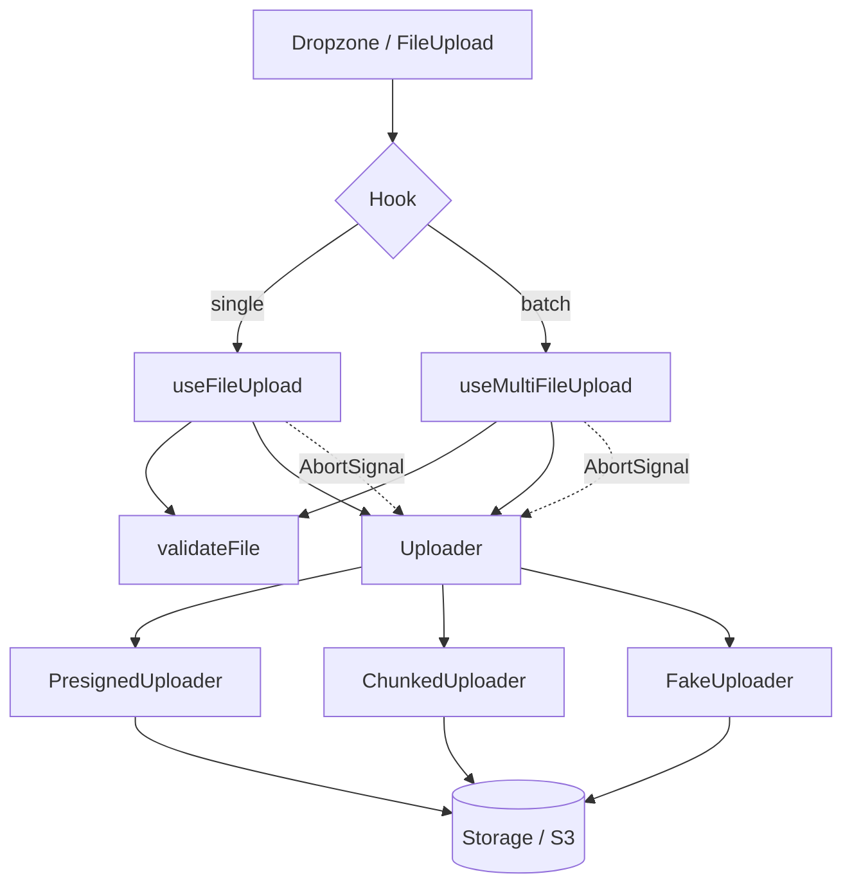

<div align="center">


# file-upload-react

### A complete, strict-typed React toolkit for file uploads — dropzone, multi-file progress, image previews, chunking, cancel & retry.

**Built and maintained by [Viprasol Tech](https://viprasol.com)**

[](https://www.npmjs.com/package/file-upload-react)
[](https://github.com/Viprasol-Tech/file-upload-react/actions/workflows/ci.yml)
[](https://www.typescriptlang.org/)
[](https://react.dev/)
[](#testing)
[](LICENSE)

</div>

---

`file-upload-react` gives you everything a real upload UI needs — a drag-and-drop
dropzone, batched multi-file uploads with independent per-file progress, inline
image previews, chunked transfers, cancellation, and retry — all behind a small,
fully-typed API. The transport is **pluggable**: ship the included presigned-URL
or chunked uploaders, or drop in your own. No CSS is imposed; every element
carries stable `data-testid` hooks so you style it your way.

## ✨ Features

- 🗂️ **Drag-and-drop dropzone** — accessible (`role="button"`, keyboard-openable), with dragging state and a hidden native input fallback.
- 📚 **Multi-file uploads** — batch many files with independent per-file status, progress, and errors, bounded by a configurable concurrency limit.
- 📊 **Per-file & overall progress** — byte-accurate progress for each file plus a size-weighted aggregate percentage.
- 🖼️ **Image previews** — automatic object-URL thumbnails for image files, revoked safely on remove/unmount to avoid leaks.
- 🧩 **Chunked uploads** — `ChunkedUploader` splits files into fixed-size parts for resumable / multipart flows.
- 🛑 **Cancel / abort** — every upload is wired to an `AbortSignal`; cancel one file or the whole batch.
- 🔁 **Retry** — re-run a failed or canceled file with a single call.
- 🔎 **Validation surface** — `accept` (MIME, `image/*`, extensions), `maxBytes`, `minBytes`, with structured error codes.
- 🧱 **Pluggable transport** — `FakeUploader` (tests/offline), `PresignedUploader` (S3-compatible), `ChunkedUploader`, or your own `Uploader`.
- 🟦 **Strict TypeScript** — no `any`, full type exports, tree-shakeable ESM.

## 📦 Install

```bash
npm install file-upload-react
# or
pnpm add file-upload-react
# or
yarn add file-upload-react
```

`react` and `react-dom` (>=17) are peer dependencies.

## 🚀 Quickstart

A drag-and-drop dropzone backed by a presigned-URL backend, in a dozen lines:

```tsx
import { Dropzone, PresignedUploader } from "file-upload-react";

const uploader = new PresignedUploader({
  // Ask your backend to sign an S3 (or compatible) PUT URL.
  getPresignedUrl: async (file) => {
    const res = await fetch(`/api/sign?name=${encodeURIComponent(file.name)}`);
    return res.json(); // -> { uploadUrl, fileUrl, headers? }
  },
});

export function Uploader() {
  return (
    <Dropzone
      uploader={uploader}
      accept="image/*"
      maxBytes={10 * 1024 * 1024}
      concurrency={3}
      onItemUploaded={(item) => console.log("done:", item.fileUrl)}
    />
  );
}
```

## 🧑‍💻 Usage

### Single file with the `useFileUpload` hook

```tsx
import { useFileUpload, PresignedUploader } from "file-upload-react";

function Avatar({ uploader }: { uploader: PresignedUploader }) {
  const { upload, cancel, retry, status, progress, error, fileUrl } =
    useFileUpload({ uploader, accept: "image/*", maxBytes: 2_000_000 });

  return (
    <>
      <input
        type="file"
        onChange={(e) => e.target.files?.[0] && upload(e.target.files[0])}
      />
      {status === "uploading" && (
        <>
          <progress max={100} value={progress.percent} />
          <button onClick={cancel}>Cancel</button>
        </>
      )}
      {status === "canceled" && <button onClick={() => retry()}>Retry</button>}
      {status === "error" && <p role="alert">{error?.message}</p>}
      {status === "success" && }
    </>
  );
}
```

### Many files with `useMultiFileUpload`

```tsx
import { useMultiFileUpload, FakeUploader } from "file-upload-react";

function Gallery() {
  const { items, add, cancel, retry, remove, overallPercent } =
    useMultiFileUpload({ uploader: new FakeUploader(), concurrency: 4 });

  return (
    <>
      <input type="file" multiple onChange={(e) => e.target.files && add(e.target.files)} />
      <progress max={100} value={overallPercent} />
      {items.map((it) => (
        <div key={it.id}>
          {it.previewUrl && }
          <span>{it.file.name} — {it.status} ({it.progress.percent}%)</span>
          {it.status === "uploading" && <button onClick={() => cancel(it.id)}>x</button>}
          {it.status === "error" && <button onClick={() => retry(it.id)}>retry</button>}
          <button onClick={() => remove(it.id)}>remove</button>
        </div>
      ))}
    </>
  );
}
```

### Chunked uploads

```tsx
import { ChunkedUploader } from "file-upload-react";

const uploader = new ChunkedUploader({
  chunkSize: 5 * 1024 * 1024, // 5 MiB parts
  getPresignedUrl: async (file) => fetchTargetFor(file),
  uploadChunk: async (chunk, info, file, signal) => {
    await fetch(`/api/upload/${file.name}/part/${info.index}`, {
      method: "PUT",
      body: chunk,
      signal,
    });
  },
});
```

## 📚 API

### Components & hooks

| Export | Kind | Purpose |
| --- | --- | --- |
| `Dropzone` | component | Drag-and-drop area with multi-file progress, previews, cancel/retry/remove. |
| `FileUpload` | component | Single-file input with progress, cancel, retry, and error display. |
| `useFileUpload` | hook | Validate + upload one file; `upload`, `cancel`, `retry`, `reset`. |
| `useMultiFileUpload` | hook | Batch uploads; `add`, `cancel`, `cancelAll`, `retry`, `remove`, `clear`. |

### Uploaders

| Export | Purpose |
| --- | --- |
| `PresignedUploader` | Uploads bytes directly to a presigned URL via `XMLHttpRequest` (real progress + abort). |
| `ChunkedUploader` | Splits a file into chunks and uploads them sequentially with cumulative progress. |
| `FakeUploader` | In-memory uploader for tests/offline; supports `steps`, `delayMs`, `failWith`. |

### Utilities & types

| Export | Purpose |
| --- | --- |
| `validateFile(file, opts)` | Pure validation against `accept` / `maxBytes` / `minBytes`. |
| `createPreviewUrl` / `revokePreviewUrl` / `isImageFile` | Image preview lifecycle helpers. |
| `formatBytes(n)` | Human-readable size string, e.g. `1.5 MB`. |
| `makeProgress` / `zeroProgress` | Build normalized `UploadProgress` objects. |
| `AbortError` / `isAbortError` | Distinguish deliberate cancellation from real failures. |
| Types | `Uploader`, `UploadItem`, `UploadProgress`, `UploadStatus`, `FileStatus`, `ValidateOptions`, `PutFileOptions`, … |

## 🧭 Architecture



## ✅ Roadmap

- [x] Drag-and-drop dropzone
- [x] Multi-file uploads with per-file progress
- [x] Image previews
- [x] Chunked upload support
- [x] Cancel / abort
- [x] Retry
- [x] `accept` / size validation surface
- [ ] Resumable uploads (persist completed chunk offsets)
- [ ] Parallel chunk uploads within a single file
- [ ] Headless render-prop / `asChild` styling API

## ❓ FAQ

**Does it ship any CSS?**
No. Components render semantic, unstyled markup with stable `data-testid` and
`data-status` hooks so you can style them however you like.

**Which React versions are supported?**
React 17, 18, and 19 (declared as a `>=17` peer dependency).

**How do I upload to S3?**
Use `PresignedUploader` and have your backend return `{ uploadUrl, fileUrl }`
from a presigned PUT. For very large files, use `ChunkedUploader` with S3
multipart part URLs.

**Why does the preview thumbnail need revoking?**
`URL.createObjectURL` holds the file in memory until revoked. The library revokes
preview URLs automatically on `remove`, `clear`, and unmount.

## 🛠️ Testing

```bash
npm install
npm run typecheck   # tsc --noEmit, zero errors
npm test            # vitest run — 59 tests
```

## 🤝 Contributing

Contributions are welcome! Please read [CONTRIBUTING.md](CONTRIBUTING.md) and our
[Code of Conduct](CODE_OF_CONDUCT.md). Open an issue to discuss substantial
changes before sending a pull request, keep the type checker and test suite
green, and add tests for new behavior.

## Contact — Viprasol Tech Private Limited

- Website: [viprasol.com](https://viprasol.com)
- Email: [support@viprasol.com](mailto:support@viprasol.com)
- Telegram: [t.me/viprasol_help](https://t.me/viprasol_help) | WhatsApp: +91 96336 52112
- GitHub: [@Viprasol-Tech](https://github.com/Viprasol-Tech) | [LinkedIn](https://www.linkedin.com/in/viprasol/) | X [@viprasol](https://twitter.com/viprasol)

## License

[MIT](LICENSE) (c) 2025 Viprasol Tech Private Limited
